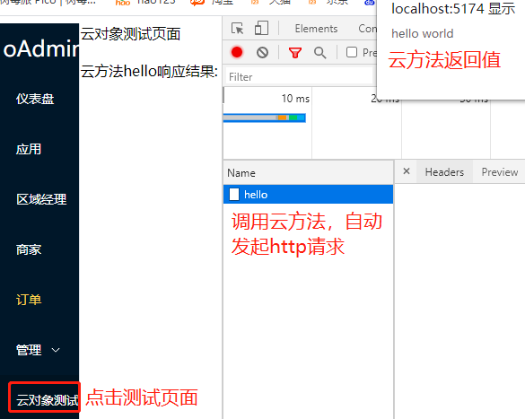

# oapi
oapi是以云对象代替http接口的新技术，和正常对象一样调用后端方法的形式,代替传统复杂的http
## 定义一个云对象，和hello云方法
api目录下创建Student.ts云对象
````ts
export class Student  {
    name=''
    age=0
    sex=0
    score=0
    async hello() {
        return 'hello world'
    }
}

````
## http形式访问：
````
curl http://localhost:3000/student/hello
````
接口响应结果
````
"hello world"
````

## 云对象方式访问
在views/test.vue里面调用云对象，点击admin的云对象测试菜单，看页面结果<br>
打开f12看http请求，这是云对象调用，非本地调用
````vue
<script setup lang="ts">
  import {Student} from "../../../api/Student";
  import {onMounted, ref} from "vue";
  let s=new Student() //创建云对象
  let msg=ref('')
  onMounted(async ()=>{
    let rsp=await s.hello()//异步调用hello云方法
    alert(rsp)     //弹窗显示云方法调用结果
    msg.value=rsp  //把结果展示到页面
  })
</script>
<template>
  <view>云对象测试页面</view> <br>
  <br>
  <view>云方法hello响应结果:{{msg}}</view>
</template>
<style scoped>
</style>
````
## 查看页面结果

